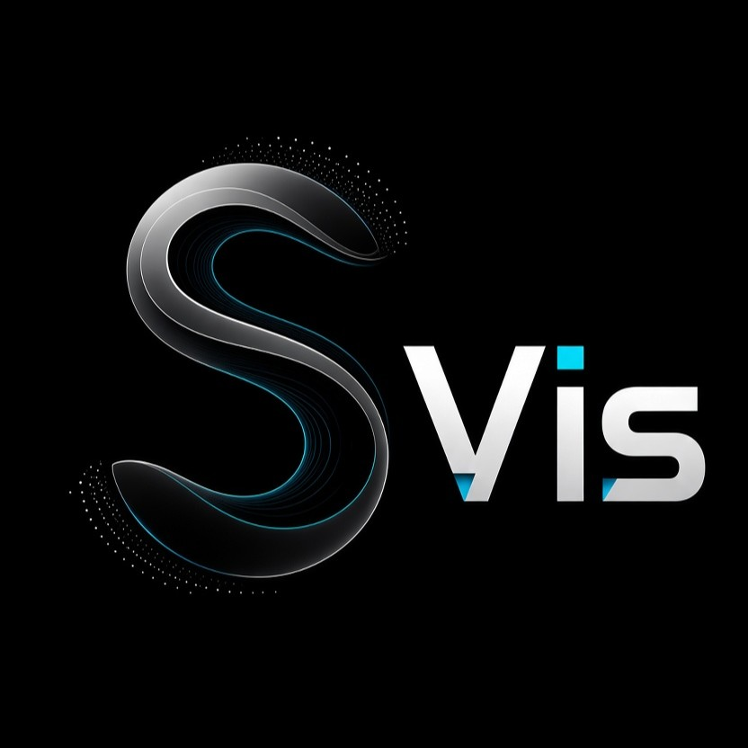

<table>
  <tr>
    <td>
      
    </td>
    <td>
      <h1>SciVis: Scientific Simulation Visualization Platform</h1>
          A modular Python/PyQt5 desktop application for scientific simulation visualization, data inspection, analysis, machine-learning workflows, and publication-oriented plotting.
    </td>
  </tr>
</table>

</div>

The project is organized so that scientific data operations can be reused independently of the Qt interface. The application currently supports simulation HDF5 workflows, 1D/2D/3D visualization, analysis tools, optional accelerated backends, and a new Phase 1 **Data Plotter** for quickly turning CSV/TXT numerical data into figures.

## Project status

The codebase is under active development. The current implementation includes the Phase 1 Data Plotter MVP described in the product request:

- CSV and TXT loading, including multiple files
- automatic delimiter detection with comma, tab, space, and semicolon options
- comment lines beginning with `#`
- header detection and generated column names when no header exists
- numeric columns with invalid/missing values represented as `NaN`
- clear parser errors for unsupported, empty, or malformed files
- drag-and-drop of CSV/TXT files into the Data Plotter
- per-dataset visibility and editable legend labels
- independent X/Y column selection for each loaded dataset
- line, scatter, line + scatter, and histogram plotting
- count, probability, and density histogram normalization
- linear and logarithmic X/Y axes
- editable X/Y axis labels
- Matplotlib zoom, pan, reset-view, and autoscale toolbar
- PNG, SVG, and PDF export with configurable DPI and figure dimensions
- basic data inspection
- reusable parser, data model, renderer, and transformation modules
- tests for parsing, transformations, and rendering

The current implementation also includes the recent performance and simulation-view improvements described below. The architecture remains incremental so further analysis tools can be added without rewriting the rendering stack.

## Architecture

The application uses PyQt5 for the desktop interface and Matplotlib for the main 1D/2D plotting workflow. PyVista is used for optional 3D rendering, and VisPy is an optional GPU-backed 2D viewer.

The main layers are:

```text
scientific_visualization/
├── core/                 # Shared Dataset and coordinate abstractions
├── io/                   # HDF5, simulation, particle and track readers
├── analysis/             # Statistics, lineouts, spectra, expressions, ROIs, etc.
├── physics/              # Coordinate-aware differential operators and backends
├── ml/                   # Feature extraction, models, surrogate/active-learning APIs
├── uncertainty/          # Uncertainty utilities
├── simulation/           # External simulation process runner
├── visualization/        # Reusable 1D/2D/3D/GPU renderers
├── export/               # Figure, data, animation and movie export
├── data_plotter/         # Reusable CSV/TXT plotting primitives
└── gui/                  # PyQt5 presentation layer
```

The Data Plotter specifically follows:

```text
CSV/TXT file
    ↓
data_plotter.parser
    ↓
DatasetTable
    ↓
optional TransformPipeline
    ↓
DataPlotRenderer
    ↓
PlotCanvas / DataPlotterTab
```

This keeps file parsing and numerical processing independent of Qt, which makes the functionality easier to test and extend.

## Repository layout

```text
scientific_simulation_platform/
├── run_visualizer.py
├── requirements.txt
├── pyproject.toml
├── scientific_visualization/
│   ├── core/
│   ├── io/
│   ├── analysis/
│   ├── physics/
│   ├── ml/
│   ├── uncertainty/
│   ├── simulation/
│   ├── visualization/
│   ├── export/
│   ├── data_plotter/
│   └── gui/
└── tests/
```

## Installation

Python 3.10+ is recommended.

Create a virtual environment:

```bash
python -m venv .venv
source .venv/bin/activate
```

On Windows PowerShell:

```powershell
python -m venv .venv
.venv\Scripts\Activate.ps1
```

Install the main dependencies:

```bash
pip install -r requirements.txt
```

The package also contains optional components. PyVista/PyVistaQt provide the 3D viewer, scikit-learn provides the machine-learning features, OpenCV and imageio provide optional movie/export functionality, and VisPy enables the optional GPU 2D viewer.

For editable development installation:

```bash
pip install -e .
```

## Running the application

From the repository root:

```bash
python run_visualizer.py
```

The application entry point is `scientific_visualization.app:main`.

## Data Plotter

Open the **Data Plotter** tab from the main application.

The intended basic workflow is:

```text
Open Data Plotter
    ↓
Select one or more CSV/TXT files
    ↓
Check the detected columns
    ↓
Select X and Y
    ↓
Choose Line / Scatter / Line + Scatter
    ↓
Adjust axis labels or log scales
    ↓
Export PNG, SVG, or PDF
```

Files can also be dragged into the Data Plotter.

### Supported text formats

Typical CSV:

```text
Time,Energy
0.0,1.2
1.0,1.5
2.0,1.9
```

Typical whitespace-delimited TXT:

```text
0.0  1.2
1.0  1.5
2.0  1.9
```

Comments beginning with `#` are ignored:

```text
# simulation output
# columns: time energy
Time,Energy
0.0,1.2
1.0,1.5
```

Automatic detection can identify common comma, tab, semicolon, and whitespace-separated files. The selected delimiter can be changed and the dataset reloaded.

### Headers

A textual first row followed by numeric rows is treated as a header when the shape is consistent. When no header is detected, columns are named:

```text
Column 1
Column 2
Column 3
...
```

### Missing or invalid values

A field that cannot be converted to a numeric value is represented internally as `NaN`. The plotting layer filters non-finite points before drawing standard XY series, preventing malformed individual values from crashing the plot.

Rows with an incompatible number of fields are skipped and counted. A file with no usable numeric rows produces a clear `ValueError` and the GUI reports the error instead of crashing.

## Plot types

### XY plots

The Phase 1 plotter provides:

- Line
- Scatter
- Line + Scatter

Each loaded dataset has its own X and Y column selection. Dataset visibility can be enabled or disabled without removing the dataset.

### Histograms

The histogram mode uses the selected Y column as the distribution. The available normalizations are:

- Count
- Probability
- Density

Multiple loaded datasets can be displayed together with semi-transparent bars.

## Figure export

Figures can be exported as:

- PNG
- SVG
- PDF

For raster output, the DPI can be set explicitly. The export panel also allows figure dimensions to be specified in centimetres.

The renderer uses Matplotlib for vector output, so SVG and PDF can preserve vector graphics.

## Existing simulation visualization

The original application remains available alongside the Data Plotter.

### Fields / Grid

The simulation grid workflow provides HDF5 loading, frame navigation, 2D maps, lineouts, time-series reduction, ROI measurements, colorbar controls, smoothing, annotations, movie export and 3D handoff.

### 3D Viewer

The 3D workflow uses PyVista when installed and supports volume rendering, isosurfaces, clipping, camera presets, screenshots and 2D-to-3D visualization.

### Analysis and modeling

The repository includes analysis and ML infrastructure for statistics, lineouts, expressions, spectral analysis, feature extraction, classical models, neural models, uncertainty foundations, surrogate models and active-learning foundations.


## Simulation performance and interactive viewing

The simulation viewer uses lazy metadata access and a bounded frame cache. Navigating between nearby time steps therefore reuses recently loaded frames instead of reopening the same HDF5 data repeatedly. The plotting path also uses deferred Matplotlib redraws and avoids allocating a finite-value copy when only simple extrema are required.

The project already contains an optional native C++/OpenMP backend for computational kernels in `scientific_visualization/physics/`. NumPy remains the reference path. C++ is used where the operation is computationally intensive enough to justify the array conversion and extension-call overhead. Simple reductions such as `mean` are already implemented in optimized NumPy code and are intentionally not duplicated in C++.

### 3D view controls

The 3D Viewer now provides explicit left/right/up/down camera translation buttons in addition to rotation, zoom, pan, and camera presets. Previous/next frame controls use the same lazy series model as the Fields / Grid tab.

### XML sessions

Both the Fields / Grid and 3D Viewer tabs can save and restore an `.xml` session. Sessions store source paths, selected frame, plot/view settings, analysis settings, and the 3D camera position/focal point/up vector where applicable. Source data are not embedded in the XML file.

### Directional averaging

The Fields / Grid time-series mode supports:

```text
average,dir=x
average,dir=y
average,dir=z
average,dir=(x,y,z)
```

For the `(x,y,z)` form, the field is averaged over all three spatial axes for every compatible frame. The resulting scalar time series can be displayed directly in the plot and exported as CSV. The implementation uses vectorized NumPy reductions rather than a Python loop over individual grid cells.

### Example data

Example numerical text data are included under [`examples/data`](examples/data):

```text
examples/data/
├── 2d/
│   ├── sample_2d_field.txt
│   ├── sample_xy.csv
│   └── sample_with_comments_and_missing.txt
└── 3d/
    └── sample_3d_field.txt
```

These examples are intentionally small so they can be used for quick testing, parser demonstrations, and documentation screenshots.

## Performance design

The existing simulation workflow uses metadata-first HDF5 loading and a small in-memory frame cache. Rendering objects are reused where possible rather than reconstructing entire Matplotlib figures for every update.

Long-running tasks such as movie export and ML training are designed to run outside the main Qt event loop.

The Data Plotter Phase 1 parser is deliberately separated from the GUI so that background parsing can be added without changing the parser API. Large-file background processing is part of the planned next performance refinement for this module.

## Testing

Run all tests:

```bash
pytest -q
```

Run only Data Plotter tests:

```bash
pytest -q tests/test_data_plotter_parser.py \
          tests/test_data_plotter_transform.py \
          tests/test_data_plotter_renderer.py
```

Compile-check the Python package:

```bash
python -m compileall scientific_visualization
```

The Data Plotter tests cover delimiter/header handling, comments, invalid values, empty-file errors, transformation immutability, normalization, and XY/histogram rendering.

## Development principles

The project favors small domain modules over large GUI classes.

For new functionality:

1. Put file-format and numerical logic in a reusable non-Qt module.
2. Keep Qt widgets responsible for presentation and user interaction.
3. Pass explicit data/configuration objects between layers.
4. Avoid modifying source data unless an API explicitly documents mutation.
5. Reuse existing `BaseTab`, `PlotCanvas`, `style`, and export helpers.
6. Add unit tests around data-processing behavior.
7. Keep serialization-friendly configuration objects for features that will later support session save/restore.
8. Prefer incremental phases over one large UI rewrite.

See [`implement_guide.md`](implement_guide.md) for the extension workflow.

## Adding a new plot type

A plot type should normally be implemented first in `scientific_visualization/data_plotter/renderer.py`, using a renderer method that accepts plain data and an existing Matplotlib `Axes`.

The Qt layer should then add only the controls and connect those controls to the renderer.

For example:

```python
renderer.render_xy(
    ax,
    series,
    plot_type="Line",
    xlabel="Time (ps)",
    ylabel="Energy (eV)",
)
```

A new plot mode should not require moving parsing logic into the GUI.

## Roadmap

### Phase 1: Data Plotter MVP

Implemented:

- CSV/TXT loading
- multiple datasets
- delimiter/header detection
- X/Y selection
- line/scatter/line + scatter
- histogram
- visibility and labels
- linear/log axes
- basic inspection
- PNG/SVG/PDF export
- tests

### Phase 2: Scientific figure formatting

Planned:

- font family and size controls
- axis/tick/legend typography
- line width and style controls
- marker controls
- individual dataset color editing
- axis limits
- minor ticks
- grid controls
- publication template
- paper-oriented figure sizes
- DPI presets

### Phase 3: Data processing

Planned:

- scale and offset operations
- normalization
- subtraction from first value
- mathematical transforms
- filtering
- downsampling
- difference plots
- ratio plots
- error bars

### Phase 4: Paper figure tools

Planned:

- text and arrow annotations
- reference lines
- shaded regions
- subplots
- shared axes
- saved templates
- plotting sessions
- copy-to-clipboard support

The application should remain useful after every phase, with a stable build and test suite after each increment.

## Git workflow

A normal Git workflow is:

```bash
git init
git add .
git commit -m "Initial scientific visualization platform"
```

Then create a remote repository and push:

```bash
git branch -M main
git remote add origin <your-repository-url>
git push -u origin main
```

Do not commit virtual environments, build output, IDE metadata, or generated large simulation data. The repository already contains a `.gitignore`; review it before the first push.

## License

No license has been inferred or added by this implementation. Add the license file that matches the project's intended distribution terms before publishing a public repository.

## Fast multi-file comparison plotting

The Data Plotter supports opening many `.csv` and `.txt` files in one operation or by drag-and-drop. Each dataset retains its own X/Y column selection, label, visibility, line style, marker and color. This is intended for workflows such as experiment vs simulation, parameter sweeps, and strong/weak scaling studies.

Available comparison presets include:

- Raw comparison
- Normalize Y to first value
- Strong scaling: speedup
- Strong scaling: efficiency

Scientific colour palettes include Scientific, Viridis, Tableau, and Grayscale, with a custom color picker for individual datasets.

Batch parsing is performed outside the GUI event handler using a bounded thread pool, so opening many moderate-size text files does not unnecessarily block the Qt interface.
